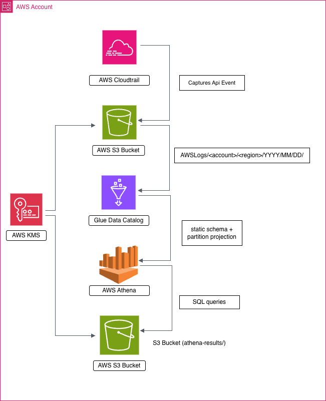
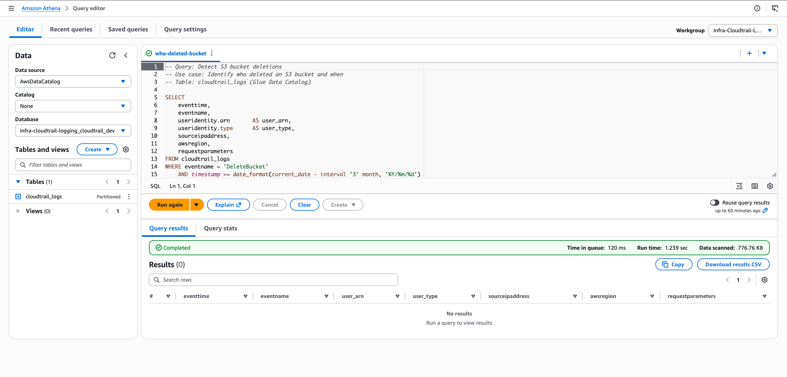
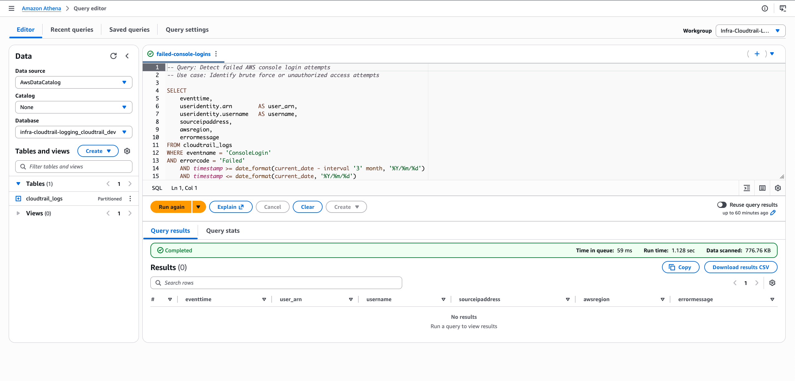
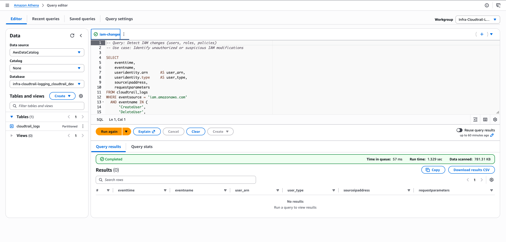
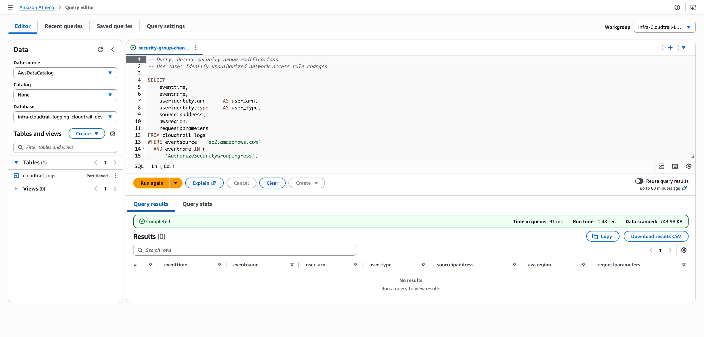
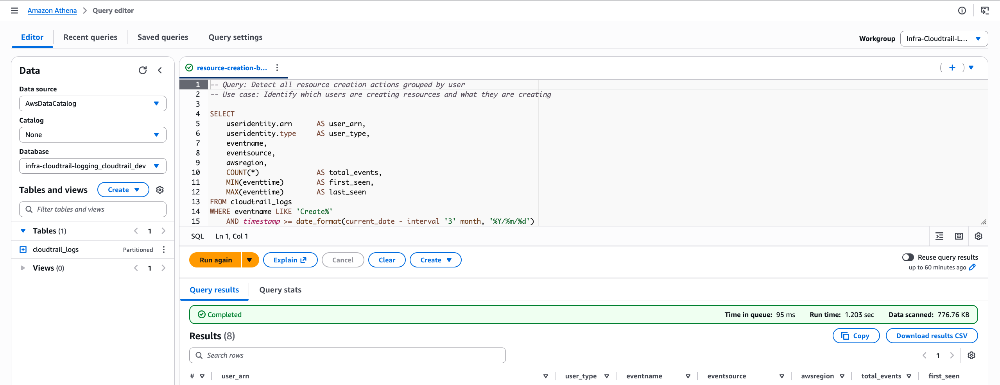
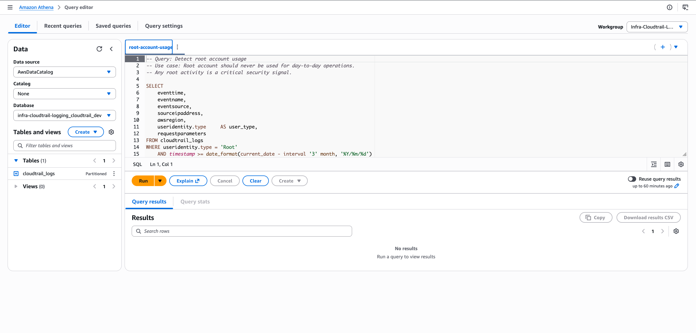

# infra-cloudtrail-logging

> Terraform-based AWS audit logging infrastructure for security monitoring and forensic analysis.
> Captures all API activity via CloudTrail, stores encrypted logs in S3, and enables SQL-based investigation through Athena with partition projection for cost-efficient querying.

## Architecture


## Features
- API activity capture via CloudTrail (single-region)
- KMS-encrypted S3 storage with lifecycle policies (Glacier 30d / Delete 90d)
- Athena querying via static Glue Data Catalog (partition projection)
- Pre-built security SQL queries for incident investigation

## Stack
- **IaC:** Terraform
- **Cloud:** AWS
  - CloudTrail — API activity logging
  - KMS — encryption at rest
  - S3 — log storage with lifecycle policies
  - Glue Data Catalog — static table schema for CloudTrail logs
  - Athena — serverless SQL querying
  - EventBridge — real-time event detection *(v1.1)*
  - SNS — alerting and notifications *(v1.1)*
- **CI/CD:** GitHub Actions
- **Secret management:** GitHub Secrets + Variables

## Repository Structure
```
infra-cloudtrail-logging/
├── infra/                    # Root Terraform configuration and module orchestration
├── modules/
│   ├── s3-logs/              # KMS key + S3 bucket with encryption and lifecycle policies
│   ├── cloudtrail/           # CloudTrail trail with log file validation
│   └── athena/               # Glue Data Catalog, Athena workgroup and named queries
│       └── queries/          # SQL queries for security investigation
├── backends/                 # Remote backend config per environment (dev/prod)
├── environments/             # Variable definitions per environment (dev/prod)
├── docs/                     # Architecture and CI/CD documentation
└── scripts/                  # Terraform plan summary scripts for CI/CD
```

## Prerequisites
- Terraform `>= 1.14.0`
- AWS Provider `~> 5.0`
- AWS CLI installed and configured with a named profile
- Copy and fill in your values:
  - `environments/dev.tfvars.example` -> `environments/dev.tfvars`
- *(Optional)* S3 remote backend — see [infra-backend](https://github.com/kalabtech/infra-backend)
  - `backends/dev.hcl.example` -> `backends/dev.hcl`
  - `backends/prod.hcl.example` -> `backends/prod.hcl`

## ## Usage

### Without remote backend (local state)
```bash
terraform -chdir=infra init
terraform -chdir=infra plan -var-file=../environments/dev.tfvars
terraform -chdir=infra apply -var-file=../environments/dev.tfvars
```
### With remote backend and makefile
```bash
make init ENV=dev
make plan ENV=dev
make apply ENV=dev
```

## Design Decisions
- **KMS + S3 in single module** — KMS is scoped exclusively to this bucket with no reuse elsewhere. Merging both reduces complexity without sacrificing separation of concerns.
- **Static Glue table over Crawler** — CloudTrail schema is well-known and never changes. A static table avoids Crawler execution costs and reduces operational complexity.
- **Partition projection** — eliminates full bucket scans on every Athena query by computing S3 paths directly from date partitions.
- **Single-region trail** — cost optimization for demo purposes. Multi-region coverage recommended for production workloads.
- **No hardcoded values** — sensitive config (account ID, credentials) stored in GitHub Secrets. Non-sensitive config (region, environment) in GitHub Variables.

## Security Queries
Predefined queries available in Athena under **Saved Queries**. All queries cover the last 90 days and use partition projection for cost-efficient scanning.

| Query | Description |
|-------|-------------|
| `who-deleted-bucket.sql` | Detect S3 bucket deletions |
| `failed-console-logins.sql` | Failed AWS console login attempts |
| `iam-changes.sql` | IAM user/role/policy modifications |
| `security-group-changes.sql` | Security group rule changes |
| `resource-creation-by-user.sql` | Resource creation by principal |
| `root-account-usage.sql` | Root account activity — critical signal |

<details>
<summary>Who deleted a bucket?</summary>

</details>

<details>
<summary>Failed console logins</summary>

</details>

<details>
<summary>IAM changes</summary>

</details>

<details>
<summary>Security group changes</summary>

</details>

<details>
<summary>Resource creation by user</summary>

</details>

<details>
<summary>Root account usage</summary>

</details>
